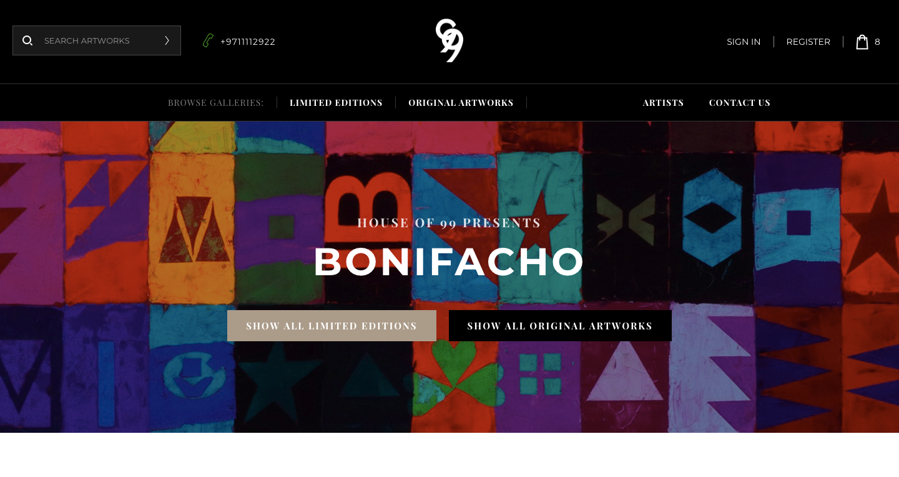

# Bonifacho - Artwork marketplace

[Bonifacho](https://bonifacho.herokuapp.com/)



## Table of content

- [Description](#description)
- [Technologies](#technologies)
- [Installation](#installation)
- [Contact](#contact)

## Description

Bonifacho is an artwork marketplace built using the MERN stack. It lets you:

1. Create an account either as an Artist or Collector
2. Artists can manage their artwork (Create, Update, Read, Delete) and put them up for sale
3. Collectors can view the artworks, add them to their cart and make payments with Stripe

## Technologies

The project is built using the MERN Stack.

### Features - MERN

#### Express, MongoDB, Mongoose, NodeJS

- API
  `CRUD`, `Filtering`, `Pagination`, `Projection`, `Sorting`, `Aliasing`, `Aggregation`, `Advanced modelling`, `populating`, `geolocation`
- Authentication
  `sign-up`, `login`, `authorization`, `jwt`, `forget password`, `reset password`, `update password`, `update account`, `reset account`
- Security
  `cors`, `rate limiting`, `cookie`, `http headers`, `data sanitize`, `parameter pollution prevention`
- Advance Error Handling

#### React

- `ReactJS`, `Redux`, `Material-ui`

## Installation

1. Clone the project to your local directory

```
git clone https://github.com/KaushikShivam/bonifacho
```

2. The project uses NPM for managing dependencies. Run npm install to install all the required dependencies

```
npm install
```

3. Navigate into the client directory

```
npm run dev
```

## Contact

You can contact me at:

- [Portfolio](www.shivamkaushik.com)
- [Email](shivamkaushikofficial@gmail.com)
- [Linkedin](https://www.linkedin.com/in/kshivamdev/)
- [Twitter](https://twitter.com/kShivamDev)
- [Medium](https://medium.com/@shivamkaushikofficial)
- [Angellist](https://angel.co/kshivamdev)
